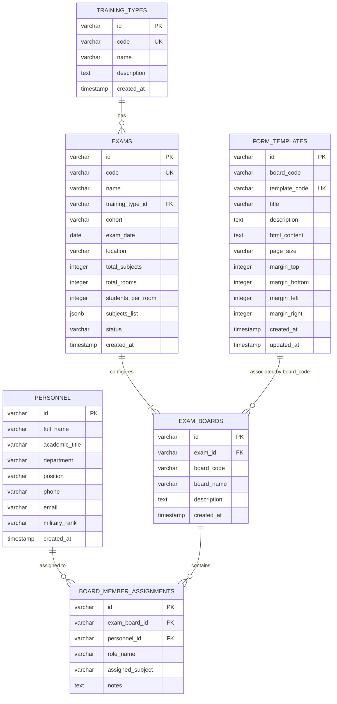

# Database Schema and Data Models

This document specifies the PostgreSQL database schema used by the Graduation Exam Form Management system. The tables are managed through Django ORM and correspond to the PostgreSQL database container `qlbm_db`.

---

## Entity Relationship Summary

---

## Tables Specification

### 1. `training_types` (Loại hình đào tạo)
Stores education and training types (e.g. Đại học, Cao đẳng).

| Column Name | Data Type | Constraints | Description |
| :--- | :--- | :--- | :--- |
| `id` | `varchar(50)` | Primary Key | Unique ID |
| `code` | `varchar(50)` | Unique | Code identifier |
| `name` | `varchar(200)` | Not Null | Display name |
| `description` | `text` | Nullable | Optional notes |
| `created_at` | `timestamp` | Auto Now Add | Creation time |

### 2. `personnel` (Cán bộ giảng viên)
Stores details of lecturers and officials assigned to exam boards.

| Column Name | Data Type | Constraints | Description |
| :--- | :--- | :--- | :--- |
| `id` | `varchar(50)` | Primary Key | Unique ID |
| `full_name` | `varchar(200)` | Not Null | Officer full name |
| `academic_title`| `varchar(50)` | Not Null | Academic title (TS., PGS.TS., ThS., CN.) |
| `department` | `varchar(200)` | Not Null | Work department / division |
| `position` | `varchar(100)` | Not Null | Main position / role |
| `phone` | `varchar(20)` | Nullable | Phone number |
| `email` | `varchar(100)` | Nullable | Email address |
| `military_rank` | `varchar(50)` | Nullable | Military Rank (Thiếu tá, Trung tá, Đại tá...) |
| `created_at` | `timestamp` | Auto Now Add | Profile creation time |

### 3. `exams` (Kỳ thi tốt nghiệp)
Stores general settings and schedules for the graduation exams.

| Column Name | Data Type | Constraints | Description |
| :--- | :--- | :--- | :--- |
| `id` | `varchar(50)` | Primary Key | Unique ID |
| `code` | `varchar(50)` | Unique | Exam code |
| `name` | `varchar(200)` | Not Null | Exam name |
| `training_type_id`| `varchar(50)`| FK (`training_types.id`)| Associated training type |
| `cohort` | `varchar(100)` | Not Null | Graduation cohort class |
| `exam_date` | `date` | Not Null | Exam schedule date |
| `location` | `varchar(200)` | Not Null | Venue / location |
| `total_subjects`| `integer` | Default 0 | Total subjects count |
| `total_rooms` | `integer` | Default 0 | Total exam rooms |
| `students_per_room`|`integer` | Default 0 | Average students capacity per room |
| `subjects_list`| `jsonb` | Default `[]` | List of subject names array |
| `status` | `varchar(20)` | Default `'planning'` | Status: `planning`, `ongoing`, `completed` |
| `created_at` | `timestamp` | Auto Now Add | Record creation time |

### 4. `exam_boards` (Ban chuyên trách kỳ thi)
Specific boards set up under each exam (e.g. Ban Đề thi, Ban Coi thi).

| Column Name | Data Type | Constraints | Description |
| :--- | :--- | :--- | :--- |
| `id` | `varchar(50)` | Primary Key | Unique ID |
| `exam_id` | `varchar(50)` | FK (`exams.id`) | Belongs to exam |
| `board_code` | `varchar(50)` | Not Null | Code: `DE_THI`, `COI_THI`, `PHACH`, `CHAM_THI`, `GIAM_SAT`, `GENERAL` |
| `board_name` | `varchar(100)` | Not Null | Board display name |
| `description` | `text` | Nullable | Details / purpose |
| `created_at` | `timestamp` | Auto Now Add | Board setup time |

*Unique constraint: `(exam_id, board_code)` ensures a board code can only be created once per exam.*

### 5. `board_member_assignments` (Phân công cán bộ)
Stores staff assignments and roles within each exam board.

| Column Name | Data Type | Constraints | Description |
| :--- | :--- | :--- | :--- |
| `id` | `varchar(50)` | Primary Key | Unique ID |
| `exam_board_id`| `varchar(50)` | FK (`exam_boards.id`)| Assigned board |
| `personnel_id` | `varchar(50)` | FK (`personnel.id`) | Assigned officer |
| `role_name` | `varchar(100)` | Not Null | Assignment role (Trưởng ban, Phó trưởng ban...) |
| `assigned_subject`|`varchar(200)`| Nullable | Subject assigned to handle |
| `notes` | `text` | Nullable | Optional annotations |

### 6. `form_templates` (Thư viện biểu mẫu)
HTML templates used for generation of dynamic Word documents.

| Column Name | Data Type | Constraints | Description |
| :--- | :--- | :--- | :--- |
| `id` | `varchar(50)` | Primary Key | Unique ID |
| `board_code` | `varchar(50)` | Not Null | Category identifier |
| `template_code`| `varchar(50)` | Unique | Unique template code |
| `title` | `varchar(200)` | Not Null | Document title |
| `description` | `text` | Nullable | Document purpose details |
| `html_content` | `text` | Not Null | Full HTML code with placeholder tags |
| `page_size` | `varchar(20)` | Default `'A4'` | Print size layout: `A4`, `A5`, `Letter` |
| `margin_top` | `integer` | Default `20` | Top margin in mm |
| `margin_bottom`| `integer` | Default `20` | Bottom margin in mm |
| `margin_left` | `integer` | Default `30` | Left margin in mm |
| `margin_right` | `integer` | Default `15` | Right margin in mm |
| `created_at` | `timestamp` | Auto Now Add | Creation time |
| `updated_at` | `timestamp` | Auto Now | Last update time |
